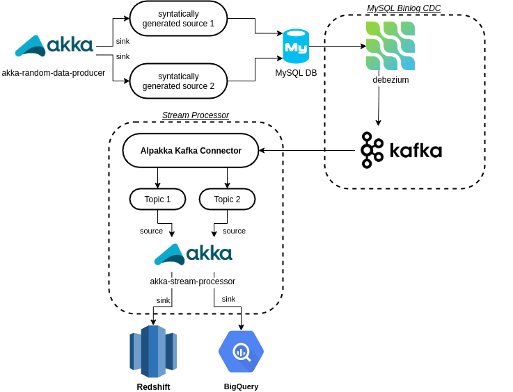
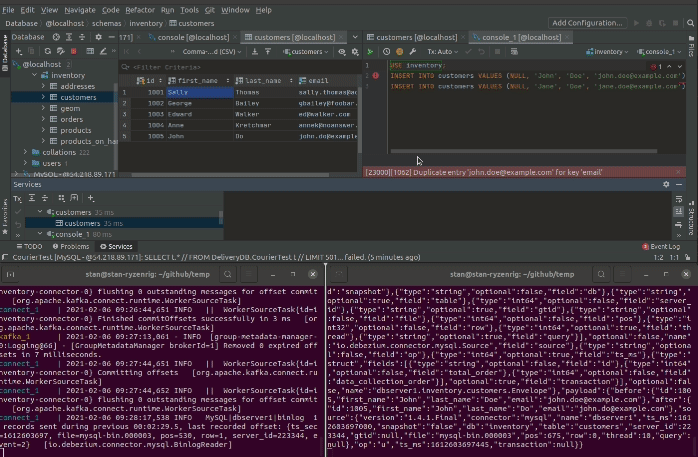

# Overview

this project primarily use these few following components: 

## Architecture Diagram




# Setup Guide

To set up development environment locally:

```
# pull yaml & config files
wget https://raw.githubusercontent.com/debezium/debezium-examples/master/tutorial/docker-compose-mysql.yaml

wget https://raw.githubusercontent.com/debezium/debezium-examples/master/tutorial/register-mysql.json
```

```
# Start the topology as defined in https://debezium.io/docs/tutorial/
export DEBEZIUM_VERSION=1.4
docker-compose -f docker-compose-mysql.yaml up

# Start MySQL connector
curl -i -X POST -H "Accept:application/json" -H  "Content-Type:application/json" http://localhost:8083/connectors/ -d @register-mysql.json

# Consume messages from a Debezium topic
docker-compose -f docker-compose-mysql.yaml exec kafka /kafka/bin/kafka-console-consumer.sh \
    --bootstrap-server kafka:9092 \
    --from-beginning \
    --property print.key=true \
    --topic dbserver1.inventory.customers

# Modify records in the database via MySQL client
docker-compose -f docker-compose-mysql.yaml exec mysql bash -c 'mysql -u $MYSQL_USER -p$MYSQL_PASSWORD inventory'

# Shut down the cluster
docker-compose -f docker-compose-mysql.yaml down
```

[debezium tutorial](https://github.com/debezium/debezium-examples/tree/master/tutorial)


once setup successful, debezium will be streaming kafka topics as shown below:




# Reading Materials

[The Whys and Hows of Database Streaming](https://www.infoq.com/presentations/wepay-database-streaming/) -- recommended

[Practical Change Data Streaming Use Cases with Apache Kafka & Debezium](https://www.infoq.com/presentations/data-streaming-kafka-debezium/)

[Read from and to Kafka](https://doc.akka.io/docs/akka-projection/current/kafka.html)

[Consumer](https://doc.akka.io/docs/alpakka-kafka/0.11/consumer.html)

[Read from a Kafka topic and publish to Elasticsearch](https://akka.io/alpakka-samples/kafka-to-elasticsearch/)