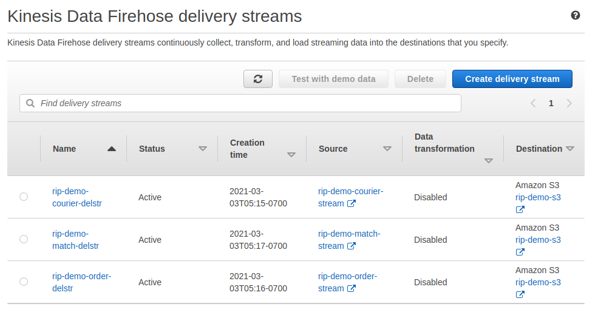

# Overview

This is an akka based stream processor school/educational project. 

[slides: Milestone Demo 1](docs/milestone-1.md)


## Architecture Diagram

this project primarily use these few following components: 


# Setup Guide

## Local setup

To set up development environment locally:

```
# pull yaml & config files
wget https://raw.githubusercontent.com/debezium/debezium-examples/master/tutorial/docker-compose-mysql.yaml

wget https://raw.githubusercontent.com/debezium/debezium-examples/master/tutorial/register-mysql.json
```

```
# Start the topology as defined in https://debezium.io/docs/tutorial/
export DEBEZIUM_VERSION=1.4
docker-compose -f docker-compose-mysql.yaml up

# Start MySQL connector
curl -i -X POST -H "Accept:application/json" -H  "Content-Type:application/json" http://localhost:8083/connectors/ -d @register-mysql.json

# Consume messages from a Debezium topic
docker-compose -f docker-compose-mysql.yaml exec kafka /kafka/bin/kafka-console-consumer.sh \
    --bootstrap-server kafka:9092 \
    --from-beginning \
    --property print.key=true \
    --topic dbserver1.inventory.customers

# Modify records in the database via MySQL client
docker-compose -f docker-compose-mysql.yaml exec mysql bash -c 'mysql -u $MYSQL_USER -p$MYSQL_PASSWORD inventory'

# Shut down the cluster
docker-compose -f docker-compose-mysql.yaml down
```

[debezium tutorial](https://github.com/debezium/debezium-examples/tree/master/tutorial)

## Kinesis Setup

| Data Stream Name        | Firsehose Delivery Stream | S3 prefix                                | S3 Bucket   |
| ----------------------- | ------------------------- | ---------------------------------------- | ----------- |
| rip-demo-courier-stream | rip-demo-courier-delstr   | courier-records / _error-courier-records | rip-demo-s3 |
| rip-demo-order-stream   | rip-demo-order-delstr     | order-records / _error-order-records     | rip-demo-s3 |
| rip-demo-match-stream   | rip-demo-match-delstr     | match-records / _error-match-records     | rip-demo-s3 |




## SBT Project Setup

Fulfil both sbt and maven dependencies, and then build the project.

To test the system, either write to the mysql db defined in the docker image or use the companion project to produce random data: 

[akka-random-data-producer](https://github.com/stancsz/akka-random-data-producer)


# Reading Materials

[The Whys and Hows of Database Streaming](https://www.infoq.com/presentations/wepay-database-streaming/) -- recommended

[Practical Change Data Streaming Use Cases with Apache Kafka & Debezium](https://www.infoq.com/presentations/data-streaming-kafka-debezium/)

https://doc.akka.io/docs/alpakka/current/kinesis.html

https://doc.akka.io/docs/alpakka/current/aws-shared-configuration.html