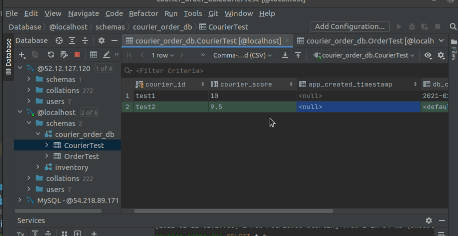
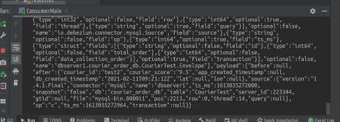

# kafka consumer demo

This is a quick md document on how to test the consumers

the topics are being passed to akka's alpakka consumer's subscription topics.

in this demo, I'll be using datagrip to update the mysql db directly.

adding a new record in `CourierTest`

observed stream in the consumer

adding a new record in OrderTest

observed stream in the consumer

Next, will implement the orders and courier matching as a lambda function to process these data. Possibly temporarily writing a in memory database such as Redis or something similar to implement this feature. 

Question: 

Recommendations?